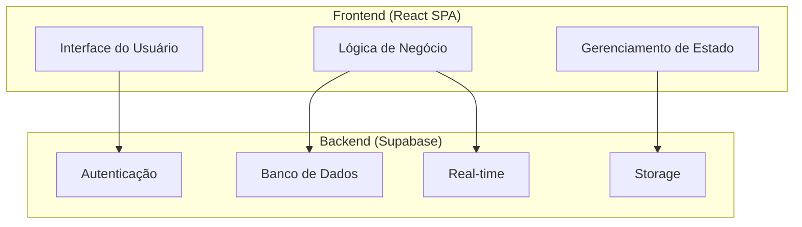
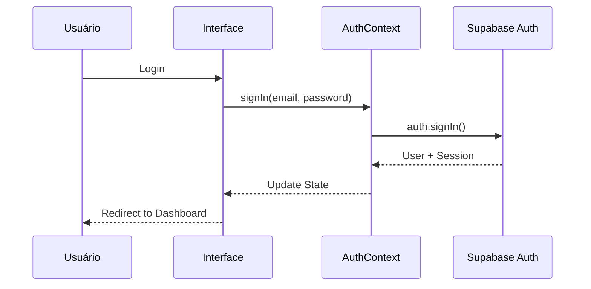
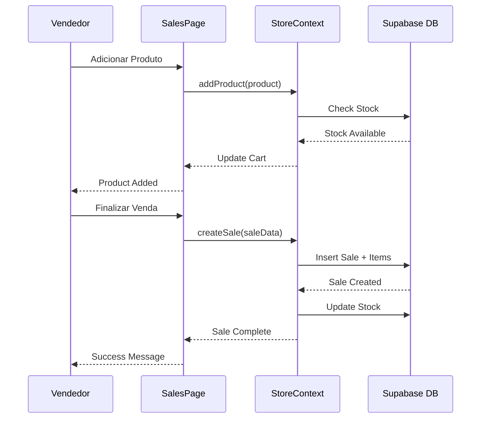
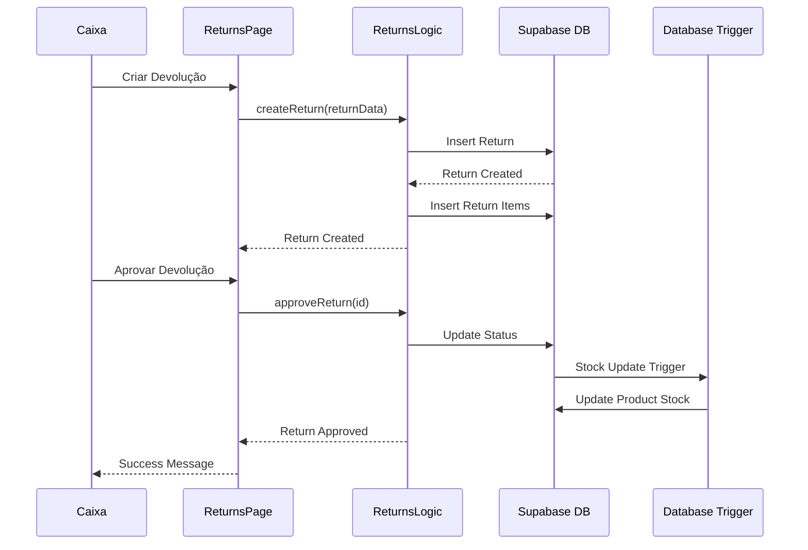

# 🏗️ ARQUITETURA DO SISTEMA - ROUPA CERTA VENDAS PLUS

## 📖 ÍNDICE

1. [Visão Geral da Arquitetura](#visão-geral-da-arquitetura)
2. [Padrões Arquiteturais](#padrões-arquiteturais)
3. [Estrutura de Camadas](#estrutura-de-camadas)
4. [Fluxo de Dados](#fluxo-de-dados)
5. [Componentes do Sistema](#componentes-do-sistema)
6. [Integrações](#integrações)
7. [Segurança](#segurança)
8. [Performance](#performance)
9. [Escalabilidade](#escalabilidade)
10. [Monitoramento](#monitoramento)

---

## 🎯 VISÃO GERAL DA ARQUITETURA

### Arquitetura Geral
O sistema segue uma arquitetura **Frontend-Backend Separados** com **Backend as a Service (BaaS)**, utilizando o Supabase como plataforma backend completa.



### Princípios Arquiteturais
- **Separação de Responsabilidades:** Cada camada tem responsabilidades bem definidas
- **Baixo Acoplamento:** Componentes independentes e reutilizáveis
- **Alta Coesão:** Funcionalidades relacionadas agrupadas
- **Escalabilidade:** Arquitetura preparada para crescimento
- **Manutenibilidade:** Código limpo e bem documentado

---

## 🏛️ PADRÕES ARQUITETURAIS

### 1. Padrão MVC (Model-View-Controller)

#### Model (Modelo)
```typescript
// Representação dos dados e lógica de negócio
interface Product {
  id: string;
  name: string;
  price: number;
  quantity: number;
  // ... outros campos
}

// Hooks customizados para lógica de negócio
export const useProductsLogic = () => {
  // Lógica de produtos
};
```

#### View (Visão)
```typescript
// Componentes React para interface
const ProductsPage = () => {
  return (
    <div>
      <ProductList />
      <ProductForm />
    </div>
  );
};
```

#### Controller (Controlador)
```typescript
// Hooks e contextos para controle de estado
export const useStore = () => {
  // Controle de estado global
};
```

### 2. Padrão Repository
```typescript
// Abstração do acesso a dados
class ProductRepository {
  async findAll(): Promise<Product[]> {
    return supabase.from('products').select('*');
  }
  
  async create(product: CreateProduct): Promise<Product> {
    return supabase.from('products').insert(product);
  }
}
```

### 3. Padrão Observer (Real-time)
```typescript
// Observação de mudanças em tempo real
useEffect(() => {
  const subscription = supabase
    .channel('products')
    .on('postgres_changes', { event: '*', schema: 'public', table: 'products' }, 
        (payload) => {
          // Atualizar estado local
        })
    .subscribe();
    
  return () => subscription.unsubscribe();
}, []);
```

---

## 📚 ESTRUTURA DE CAMADAS

### 1. Camada de Apresentação (UI Layer)

#### Componentes
```
src/components/
├── ui/                    # Componentes base (shadcn/ui)
│   ├── button.tsx
│   ├── input.tsx
│   └── card.tsx
├── dashboard/             # Componentes específicos do dashboard
├── products/              # Componentes de produtos
├── sales/                 # Componentes de vendas
├── returns/               # Componentes de devoluções
└── settings/              # Componentes de configurações
```

#### Páginas
```
src/pages/
├── Dashboard.tsx          # Dashboard principal
├── ProductsPage.tsx       # Gestão de produtos
├── SalesPage.tsx          # Sistema de vendas
├── ReturnsPage.tsx        # Devoluções e trocas
├── CustomersPage.tsx      # Gestão de clientes
└── settings/              # Páginas de configuração
```

### 2. Camada de Lógica de Negócio (Business Logic Layer)

#### Hooks Customizados
```
src/hooks/
├── useProductsLogic.ts    # Lógica de produtos
├── useSalesLogic.ts       # Lógica de vendas
├── useReturnsLogic.ts     # Lógica de devoluções
├── useAuth.ts             # Lógica de autenticação
└── useStore.ts            # Lógica de estado global
```

#### Contextos
```
src/contexts/
├── AuthContext.tsx        # Contexto de autenticação
└── StoreContext.tsx       # Contexto de estado global
```

### 3. Camada de Acesso a Dados (Data Access Layer)

#### Integrações
```
src/integrations/
└── supabase/
    ├── client.ts          # Cliente Supabase
    └── types.ts           # Tipos do Supabase
```

#### Utilitários
```
src/utils/
├── profitCalculations.ts  # Cálculos de lucro
├── supplierUtils.ts       # Utilitários de fornecedores
└── xmlParser.ts           # Parser de XML
```

### 4. Camada de Tipos (Types Layer)

```
src/types/
├── store.ts               # Tipos do estado global
├── returns.ts             # Tipos de devoluções
└── xml-import.ts          # Tipos de importação XML
```

---

## 🔄 FLUXO DE DADOS

### 1. Fluxo de Autenticação



### 2. Fluxo de Venda



### 3. Fluxo de Devolução



---

## 🔧 COMPONENTES DO SISTEMA

### 1. Frontend (React SPA)

#### Estrutura de Componentes
```typescript
// Componente de alto nível
const SalesPage = () => {
  // Estados locais
  const [selectedCustomer, setSelectedCustomer] = useState(null);
  const [selectedProducts, setSelectedProducts] = useState([]);
  
  // Hooks customizados
  const { sales, createSale } = useStore();
  const { user } = useAuth();
  
  // Handlers
  const handleFinalizeSale = async () => {
    // Lógica de finalização
  };
  
  return (
    <div>
      <CustomerSelectionSection />
      <ProductAdditionSection />
      <ProductListSection />
      <SaleFinalizationSection />
    </div>
  );
};
```

#### Gerenciamento de Estado
```typescript
// Contexto global
const StoreContext = createContext();

export const StoreProvider = ({ children }) => {
  const [products, setProducts] = useState([]);
  const [sales, setSales] = useState([]);
  const [customers, setCustomers] = useState([]);
  
  // Métodos de negócio
  const createSale = async (saleData) => {
    // Lógica de criação de venda
  };
  
  const value = {
    products,
    sales,
    customers,
    createSale,
    // ... outros métodos
  };
  
  return (
    <StoreContext.Provider value={value}>
      {children}
    </StoreContext.Provider>
  );
};
```

### 2. Backend (Supabase)

#### Estrutura do Banco
```sql
-- Tabelas principais
CREATE TABLE products (
  id UUID PRIMARY KEY,
  name TEXT NOT NULL,
  price DECIMAL(10,2) NOT NULL,
  quantity INTEGER NOT NULL,
  -- ... outros campos
);

-- Triggers para integridade
CREATE TRIGGER update_stock_on_sale
  AFTER INSERT ON sale_items
  FOR EACH ROW
  EXECUTE FUNCTION update_product_stock();
```

#### Autenticação
```typescript
// Configuração do Supabase
const supabase = createClient(supabaseUrl, supabaseKey);

// Autenticação
const { user, session } = await supabase.auth.signIn({
  email: 'user@example.com',
  password: 'password'
});
```

---

## 🔌 INTEGRAÇÕES

### 1. Supabase

#### Autenticação
- **Provider:** Supabase Auth
- **Métodos:** Email/Senha
- **Sessões:** JWT tokens
- **Refresh:** Automático

#### Banco de Dados
- **Provider:** PostgreSQL via Supabase
- **Migrations:** Versionadas
- **Triggers:** Para integridade
- **Real-time:** Subscriptions

#### Storage
- **Provider:** Supabase Storage
- **Uso:** Imagens de produtos
- **Segurança:** Políticas RLS
- **CDN:** Distribuição global

### 2. APIs Externas (Futuro)

#### WhatsApp Business API
```typescript
// Integração futura
const sendWhatsAppMessage = async (phone, message) => {
  // Implementação da API do WhatsApp
};
```

#### Marketplaces
```typescript
// Integração com marketplaces
const syncWithMarketplace = async (products) => {
  // Sincronização de produtos
};
```

---

## 🔒 SEGURANÇA

### 1. Autenticação e Autorização

#### Autenticação
- **Provider:** Supabase Auth
- **Métodos:** Email/Senha
- **Segurança:** Rate limiting, captcha
- **Sessões:** JWT com expiração

#### Autorização
- **RBAC:** Role-Based Access Control
- **Middleware:** Proteção de rotas
- **Permissões:** Granulares por funcionalidade
- **Auditoria:** Logs de ações

### 2. Proteção de Dados

#### Criptografia
- **Transmissão:** HTTPS/TLS
- **Armazenamento:** Criptografia em repouso
- **Senhas:** Hash bcrypt
- **Tokens:** JWT assinados

#### Validação
- **Input:** Sanitização e validação
- **SQL Injection:** Prevenção via Supabase
- **XSS:** Sanitização de dados
- **CSRF:** Tokens de proteção

### 3. Políticas de Segurança

#### Senhas
- **Comprimento:** Mínimo configurável
- **Complexidade:** Caracteres especiais opcionais
- **Expiração:** Configurável
- **Histórico:** Prevenção de reutilização

#### Sessões
- **Timeout:** Configurável
- **Múltiplos Logins:** Controlável
- **Logout:** Automático por inatividade
- **Auditoria:** Logs de sessão

---

## ⚡ PERFORMANCE

### 1. Otimizações Frontend

#### Code Splitting
```typescript
// Lazy loading de rotas
const ProductsPage = lazy(() => import('./pages/ProductsPage'));
const SalesPage = lazy(() => import('./pages/SalesPage'));
```

#### Memoização
```typescript
// Memoização de componentes
const ProductCard = React.memo(({ product }) => {
  return <div>{product.name}</div>;
});

// Memoização de valores
const expensiveValue = useMemo(() => {
  return calculateExpensiveValue(data);
}, [data]);
```

#### Bundle Optimization
- **Tree Shaking:** Remoção de código não utilizado
- **Minificação:** Compressão de código
- **Gzip:** Compressão de assets
- **CDN:** Distribuição global

### 2. Otimizações Backend

#### Índices de Banco
```sql
-- Índices para consultas frequentes
CREATE INDEX idx_products_barcode ON products(barcode);
CREATE INDEX idx_sales_date ON sales(date);
CREATE INDEX idx_sales_customer_id ON sales(customer_id);
```

#### Queries Otimizadas
```typescript
// Queries com seleção específica
const { data } = await supabase
  .from('products')
  .select('id, name, price, quantity')
  .eq('category', 'Camisetas')
  .order('name');
```

#### Cache
- **Browser Cache:** Assets estáticos
- **API Cache:** Respostas frequentes
- **Database Cache:** Consultas repetidas

---

## 📈 ESCALABILIDADE

### 1. Escalabilidade Horizontal

#### Frontend
- **CDN:** Distribuição global
- **Load Balancing:** Múltiplas instâncias
- **Caching:** Cache em múltiplas camadas
- **Micro-frontends:** Arquitetura modular

#### Backend
- **Supabase:** Escalabilidade automática
- **Database:** Replicação e sharding
- **Storage:** Distribuição global
- **Real-time:** WebSockets escaláveis

### 2. Escalabilidade Vertical

#### Otimizações de Código
- **Algoritmos:** Otimização de complexidade
- **Queries:** Otimização de consultas
- **Cache:** Estratégias de cache
- **Compression:** Compressão de dados

#### Infraestrutura
- **CPU:** Aumento de recursos
- **Memory:** Mais RAM disponível
- **Storage:** Mais espaço em disco
- **Network:** Maior largura de banda

### 3. Arquitetura para Crescimento

#### Multi-tenancy
```typescript
// Preparação para multi-tenancy
interface Tenant {
  id: string;
  name: string;
  settings: TenantSettings;
}

// Filtros por tenant
const getProductsByTenant = (tenantId: string) => {
  return supabase
    .from('products')
    .select('*')
    .eq('tenant_id', tenantId);
};
```

#### Microserviços (Futuro)
- **Auth Service:** Autenticação independente
- **Product Service:** Gestão de produtos
- **Sales Service:** Sistema de vendas
- **Notification Service:** Notificações

---

## 📊 MONITORAMENTO

### 1. Métricas de Performance

#### Frontend
- **First Contentful Paint:** < 1.5s
- **Largest Contentful Paint:** < 2.5s
- **Cumulative Layout Shift:** < 0.1
- **First Input Delay:** < 100ms

#### Backend
- **Response Time:** < 200ms
- **Throughput:** Requests por segundo
- **Error Rate:** < 1%
- **Uptime:** > 99.9%

### 2. Logs e Rastreamento

#### Logs Estruturados
```typescript
// Logs estruturados
logger.info('Sale created', {
  saleId: sale.id,
  customerId: sale.customer_id,
  total: sale.total,
  timestamp: new Date().toISOString()
});
```

#### Rastreamento de Erros
```typescript
// Error boundaries
class ErrorBoundary extends React.Component {
  componentDidCatch(error, errorInfo) {
    logger.error('React error', { error, errorInfo });
  }
}
```

### 3. Alertas e Notificações

#### Alertas de Sistema
- **Downtime:** Sistema indisponível
- **High Error Rate:** Taxa de erro alta
- **Performance:** Tempo de resposta lento
- **Security:** Tentativas de acesso suspeitas

#### Métricas de Negócio
- **Vendas:** Volume de vendas
- **Usuários:** Usuários ativos
- **Produtos:** Produtos cadastrados
- **Devoluções:** Taxa de devolução

---

## 🔮 EVOLUÇÃO DA ARQUITETURA

### 1. Próximas Melhorias

#### Performance
- [ ] Service Workers para cache offline
- [ ] Virtualização de listas grandes
- [ ] Otimização de imagens
- [ ] Lazy loading avançado

#### Escalabilidade
- [ ] Implementação de cache Redis
- [ ] Microserviços para funcionalidades específicas
- [ ] Load balancing avançado
- [ ] Auto-scaling baseado em demanda

#### Segurança
- [ ] Autenticação de dois fatores
- [ ] Auditoria avançada
- [ ] Criptografia end-to-end
- [ ] Compliance com LGPD

### 2. Roadmap Técnico

#### Curto Prazo (1-3 meses)
- [ ] Testes automatizados
- [ ] CI/CD pipeline
- [ ] Monitoramento avançado
- [ ] Documentação de API

#### Médio Prazo (3-6 meses)
- [ ] App mobile (React Native)
- [ ] PWA (Progressive Web App)
- [ ] Integração com ERPs
- [ ] Analytics avançados

#### Longo Prazo (6+ meses)
- [ ] Arquitetura de microserviços
- [ ] IA e machine learning
- [ ] Blockchain para rastreabilidade
- [ ] Integração com IoT

---

**Versão:** 1.0.0  
**Última Atualização:** Janeiro 2025  
**Autor:** Equipe de Arquitetura  
**Classificação:** Técnica 