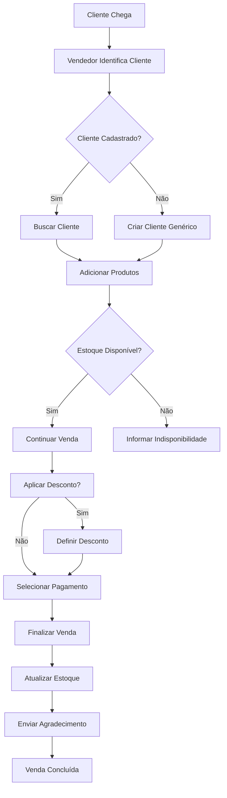
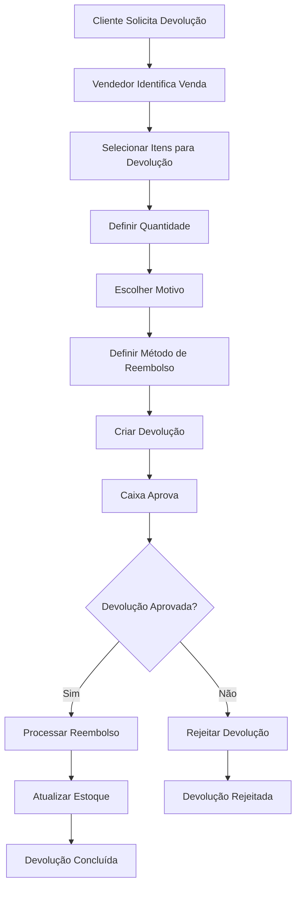
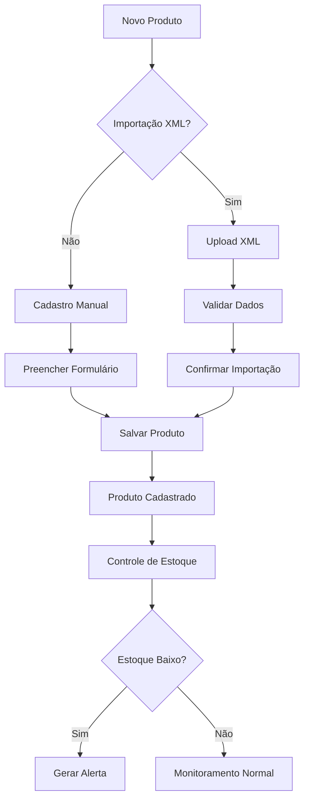

# 📋 DOCUMENTAÇÃO FUNCIONAL - ROUPA CERTA VENDAS PLUS

## 📖 ÍNDICE

1. [Visão Geral](#visão-geral)
2. [Casos de Uso](#casos-de-uso)
3. [Fluxos de Trabalho](#fluxos-de-trabalho)
4. [Funcionalidades Detalhadas](#funcionalidades-detalhadas)
5. [Regras de Negócio](#regras-de-negócio)
6. [Interface do Usuário](#interface-do-usuário)
7. [Relatórios e Analytics](#relatórios-e-analytics)
8. [Configurações e Personalização](#configurações-e-personalização)

---

## 🎯 VISÃO GERAL

### Propósito do Sistema
O **Roupa Certa Vendas Plus** é um sistema completo de gestão de vendas desenvolvido especificamente para lojas de roupas, oferecendo controle total sobre produtos, vendas, clientes, devoluções e relatórios gerenciais.

### Objetivos Principais
- **Automatizar** processos de vendas e controle de estoque
- **Facilitar** a gestão de produtos e clientes
- **Controlar** devoluções e trocas de forma eficiente
- **Fornecer** relatórios gerenciais em tempo real
- **Melhorar** a experiência do cliente e vendedor

### Público-Alvo
- **Proprietários** de lojas de roupas
- **Vendedores** e atendentes
- **Caixas** e operadores
- **Gerentes** e administradores
- **Consultores** de vendas

---

## 👥 CASOS DE USO

### 1. Administrador do Sistema

#### UC001 - Gerenciar Usuários
**Ator:** Administrador  
**Objetivo:** Criar, editar e gerenciar usuários do sistema

**Fluxo Principal:**
1. Acessar seção "Configurações > Usuários"
2. Visualizar lista de usuários
3. Criar novo usuário ou editar existente
4. Definir perfil e permissões
5. Ativar/desativar usuário

**Regras de Negócio:**
- Apenas administradores podem gerenciar usuários
- Email deve ser único no sistema
- Senha deve seguir política de segurança

#### UC002 - Configurar Sistema
**Ator:** Administrador  
**Objetivo:** Configurar parâmetros gerais do sistema

**Fluxo Principal:**
1. Acessar seção "Configurações"
2. Configurar dados da loja
3. Definir políticas de notificação
4. Configurar segurança
5. Salvar configurações

#### UC003 - Visualizar Relatórios Gerais
**Ator:** Administrador  
**Objetivo:** Acompanhar performance geral da loja

**Fluxo Principal:**
1. Acessar Dashboard
2. Visualizar métricas principais
3. Filtrar por período
4. Analisar tendências
5. Exportar relatórios

### 2. Vendedor

#### UC004 - Realizar Venda
**Ator:** Vendedor  
**Objetivo:** Processar venda de produtos para cliente

**Fluxo Principal:**
1. Acessar seção "Vendas"
2. Selecionar cliente (cadastrado ou genérico)
3. Adicionar produtos ao carrinho
4. Aplicar desconto (se necessário)
5. Selecionar método de pagamento
6. Finalizar venda
7. Enviar agradecimento (opcional)

**Regras de Negócio:**
- Verificar estoque antes de adicionar produto
- Desconto máximo de 50% do valor total
- Cliente genérico para vendas rápidas

#### UC005 - Acompanhar Performance
**Ator:** Vendedor  
**Objetivo:** Visualizar métricas pessoais de vendas

**Fluxo Principal:**
1. Acessar "Minhas Vendas"
2. Visualizar estatísticas diárias/mensais
3. Analisar histórico de vendas
4. Enviar agradecimentos a clientes

#### UC006 - Gerenciar Devoluções
**Ator:** Vendedor  
**Objetivo:** Processar devoluções e trocas

**Fluxo Principal:**
1. Acessar seção "Devoluções"
2. Selecionar venda para devolução
3. Escolher itens e quantidades
4. Definir motivo e método de reembolso
5. Criar devolução
6. Acompanhar status

### 3. Caixa

#### UC007 - Processar Pagamentos
**Ator:** Caixa  
**Objetivo:** Finalizar vendas e processar pagamentos

**Fluxo Principal:**
1. Receber venda do vendedor
2. Verificar itens e valores
3. Processar pagamento
4. Emitir comprovante
5. Finalizar transação

#### UC008 - Aprovar Devoluções
**Ator:** Caixa  
**Objetivo:** Aprovar e processar devoluções

**Fluxo Principal:**
1. Visualizar devoluções pendentes
2. Verificar itens devolvidos
3. Aprovar ou rejeitar devolução
4. Processar reembolso
5. Atualizar estoque

### 4. Consultivo

#### UC009 - Consultar Produtos
**Ator:** Consultivo  
**Objetivo:** Visualizar informações de produtos

**Fluxo Principal:**
1. Acessar seção "Produtos"
2. Buscar por nome ou código
3. Visualizar detalhes do produto
4. Verificar disponibilidade

#### UC010 - Consultar Clientes
**Ator:** Consultivo  
**Objetivo:** Visualizar informações de clientes

**Fluxo Principal:**
1. Acessar seção "Clientes"
2. Buscar cliente por nome
3. Visualizar histórico de compras
4. Verificar dados cadastrais

---

## 🔄 FLUXOS DE TRABALHO

### Fluxo de Venda Completo

### Fluxo de Devolução

### Fluxo de Gestão de Produtos

---

## ⚙️ FUNCIONALIDADES DETALHADAS

### 1. Sistema de Autenticação

#### Login
- **Campos:** Email e senha
- **Validação:** Credenciais obrigatórias
- **Segurança:** Rate limiting, captcha após tentativas
- **Lembrança:** Opção "Lembrar-me"

#### Recuperação de Senha
- **Método:** Email com link de reset
- **Expiração:** 24 horas
- **Segurança:** Token único por solicitação

#### Perfis de Acesso
- **Admin:** Acesso total
- **Vendedor:** Vendas e relatórios pessoais
- **Caixa:** Vendas e devoluções
- **Consultivo:** Apenas visualização

### 2. Gestão de Produtos

#### Cadastro de Produto
**Campos Obrigatórios:**
- Nome do produto
- Preço de venda
- Código de barras
- Categoria

**Campos Opcionais:**
- Descrição detalhada
- Preço de custo
- Imagem do produto
- Coleção
- Fornecedor
- Marca
- Tamanho
- Cor
- Gênero

#### Importação em Lote
- **Formato:** XML
- **Validação:** Estrutura e dados obrigatórios
- **Preview:** Visualização antes da importação
- **Duplicatas:** Detecção e tratamento

#### Controle de Estoque
- **Atualização:** Automática via vendas
- **Alertas:** Configurável por quantidade
- **Histórico:** Movimentações registradas
- **Produtos Temporários:** Sem afetar estoque

### 3. Sistema de Vendas

#### Processo de Venda
1. **Identificação do Cliente**
   - Busca por nome ou telefone
   - Criação de cliente genérico
   - Histórico de compras

2. **Seleção de Produtos**
   - Busca por nome ou código
   - Verificação de estoque
   - Adição de produtos temporários

3. **Cálculo de Valores**
   - Subtotal automático
   - Aplicação de descontos
   - Cálculo de impostos (se aplicável)

4. **Finalização**
   - Seleção de método de pagamento
   - Confirmação de dados
   - Geração de comprovante

#### Métodos de Pagamento
- **PIX:** Geração de QR Code
- **Débito:** Processamento via terminal
- **Crédito:** Processamento via terminal

#### Descontos
- **Percentual:** Sobre valor total
- **Valor Fixo:** Desconto direto
- **Limite:** Máximo 50% do valor

### 4. Sistema de Devoluções

#### Tipos de Devolução
- **Devolução Simples:** Reembolso total ou parcial
- **Troca:** Substituição por outro produto
- **Crédito da Loja:** Valor para futuras compras

#### Motivos de Devolução
- **Defeituoso:** Problema no produto
- **Tamanho Errado:** Não serviu
- **Cor Errada:** Diferente do esperado
- **Não Gostou:** Insatisfação geral
- **Outro:** Motivo específico

#### Processo de Aprovação
1. **Criação:** Vendedor cria devolução
2. **Análise:** Caixa verifica itens
3. **Aprovação:** Caixa aprova ou rejeita
4. **Processamento:** Reembolso e estoque
5. **Conclusão:** Devolução finalizada

### 5. Gestão de Clientes

#### Cadastro de Cliente
**Dados Básicos:**
- Nome completo
- WhatsApp
- Gênero
- Cidade

**Dados Opcionais:**
- Email
- Data de nascimento
- Endereço completo
- Observações

#### Cliente Genérico
- **Uso:** Vendas rápidas
- **Dados:** Mínimos necessários
- **Histórico:** Mantido para referência
- **Conversão:** Pode ser convertido em cliente cadastrado

#### Relacionamento
- **Histórico:** Todas as compras
- **Preferências:** Produtos mais comprados
- **Comunicação:** Agradecimentos automáticos
- **Fidelização:** Sistema de pontos (futuro)

---

## 📋 REGRAS DE NEGÓCIO

### 1. Controle de Estoque

#### Regras Gerais
- **Estoque Negativo:** Não permitido
- **Reserva:** Produtos em carrinho não afetam estoque
- **Atualização:** Apenas após confirmação da venda
- **Alertas:** Configuráveis por produto/categoria

#### Produtos Temporários
- **Criação:** Durante venda
- **Estoque:** Não afeta estoque real
- **Código:** Gerado automaticamente
- **Conversão:** Pode ser convertido em produto real

### 2. Sistema de Vendas

#### Validações
- **Cliente:** Obrigatório (cadastrado ou genérico)
- **Produtos:** Pelo menos um item
- **Estoque:** Verificação antes da venda
- **Pagamento:** Método obrigatório

#### Descontos
- **Limite:** Máximo 50% do valor total
- **Aplicação:** Sobre subtotal
- **Registro:** Histórico de descontos aplicados
- **Aprovação:** Descontos acima de 20% requerem aprovação

### 3. Devoluções

#### Prazos
- **Devolução:** Até 30 dias da compra
- **Troca:** Até 15 dias da compra
- **Produtos Usados:** Não aceitos
- **Etiquetas:** Devem estar intactas

#### Valores
- **Reembolso:** Valor pago pelo item
- **Crédito:** Valor para futuras compras
- **Troca:** Diferença de preço (se houver)
- **Taxa:** Não há taxa de devolução

### 4. Segurança

#### Senhas
- **Comprimento:** Mínimo 6 caracteres
- **Complexidade:** Configurável
- **Expiração:** 90 dias (configurável)
- **Histórico:** Últimas 3 senhas não podem ser reutilizadas

#### Sessões
- **Timeout:** 8 horas (configurável)
- **Múltiplos Logins:** Permitido (configurável)
- **Máximo:** 3 sessões simultâneas
- **Logout:** Automático por inatividade

---

## 🎨 INTERFACE DO USUÁRIO

### Design System

#### Cores Principais
- **Azul:** #2563eb (Ações primárias)
- **Verde:** #16a34a (Sucesso, vendas)
- **Vermelho:** #dc2626 (Erro, alertas)
- **Laranja:** #ea580c (Avisos, devoluções)

#### Tipografia
- **Títulos:** Inter, semibold
- **Corpo:** Inter, regular
- **Códigos:** JetBrains Mono, monospace

#### Componentes
- **Cards:** Informações agrupadas
- **Botões:** Ações claras e visíveis
- **Formulários:** Validação em tempo real
- **Tabelas:** Dados organizados e filtros

### Responsividade

#### Breakpoints
- **Mobile:** < 640px
- **Tablet:** 640px - 1024px
- **Desktop:** > 1024px

#### Adaptações
- **Sidebar:** Colapsível em mobile
- **Tabelas:** Scroll horizontal
- **Formulários:** Campos empilhados
- **Modais:** Tela cheia em mobile

### Acessibilidade

#### Navegação
- **Teclado:** Todas as ações acessíveis
- **Screen Readers:** Labels e descrições
- **Contraste:** Mínimo 4.5:1
- **Foco:** Indicadores visuais

#### Estados
- **Loading:** Skeleton loaders
- **Error:** Mensagens claras
- **Success:** Confirmações visuais
- **Empty:** Estados informativos

---

## 📊 RELATÓRIOS E ANALYTICS

### Dashboard Principal

#### Métricas em Tempo Real
- **Vendas Hoje:** Quantidade e valor
- **Produtos:** Total e estoque baixo
- **Clientes:** Total cadastrados
- **Faturamento:** Valor total

#### Gráficos
- **Vendas por Período:** Linha temporal
- **Produtos Mais Vendidos:** Ranking
- **Vendedores:** Performance comparativa
- **Categorias:** Distribuição de vendas

### Relatórios Específicos

#### Relatório de Vendas
- **Período:** Personalizável
- **Filtros:** Vendedor, cliente, produto
- **Métricas:** Quantidade, valor, desconto
- **Exportação:** PDF, Excel

#### Relatório de Produtos
- **Estoque:** Quantidade atual
- **Movimentação:** Entradas e saídas
- **Performance:** Produtos mais/menos vendidos
- **Alertas:** Produtos com estoque baixo

#### Relatório de Devoluções
- **Quantidade:** Devoluções por período
- **Motivos:** Distribuição de motivos
- **Valor:** Total reembolsado
- **Impacto:** Percentual sobre vendas

### Analytics Avançados

#### Tendências
- **Sazonalidade:** Padrões por mês/estação
- **Crescimento:** Evolução das vendas
- **Previsões:** Estimativas baseadas em histórico

#### Performance
- **Vendedores:** Ranking e metas
- **Produtos:** Margem de lucro
- **Clientes:** Valor médio de compra
- **Horários:** Picos de vendas

---

## ⚙️ CONFIGURAÇÕES E PERSONALIZAÇÃO

### Configurações da Loja

#### Dados Básicos
- **Nome:** Nome da loja
- **Endereço:** Endereço completo
- **Telefone:** Telefone principal
- **Email:** Email de contato

#### Redes Sociais
- **Instagram:** @loja
- **Facebook:** Página da loja
- **WhatsApp:** Número para contato

#### Horário de Funcionamento
- **Dias:** Segunda a domingo
- **Horários:** Abertura e fechamento
- **Feriados:** Configuração especial

### Notificações

#### Alertas de Estoque
- **Quantidade:** Limite para alerta
- **Frequência:** Real-time, diário, semanal
- **Canais:** Email, WhatsApp, sistema
- **Horário:** Horário para envio

#### Mensagens Automáticas
- **Agradecimento:** Após venda
- **Aniversário:** Cliente
- **Promoções:** Eventuais
- **Personalização:** Template configurável

### Segurança

#### Políticas de Senha
- **Comprimento:** 6-20 caracteres
- **Complexidade:** Letras, números, símbolos
- **Expiração:** 30-365 dias
- **Histórico:** 1-10 senhas anteriores

#### Sessões
- **Timeout:** 1-24 horas
- **Múltiplos Logins:** Permitir/bloquear
- **Máximo:** 1-10 sessões
- **Logout:** Forçar logout

### Backup e Manutenção

#### Backup
- **Frequência:** Diário automático
- **Retenção:** 30 dias
- **Localização:** Cloud segura
- **Restauração:** Processo simplificado

#### Manutenção
- **Horário:** Configurável
- **Notificação:** Aviso prévio
- **Duração:** Estimativa
- **Status:** Página de status

---

## 📞 SUPORTE E TREINAMENTO

### Documentação
- **Manual do Usuário:** Guia completo
- **Vídeos Tutoriais:** Passo a passo
- **FAQ:** Perguntas frequentes
- **Changelog:** Atualizações

### Suporte Técnico
- **Horário:** Segunda a sexta, 8h-18h
- **Canais:** Email, WhatsApp, telefone
- **Tempo de Resposta:** Máximo 4 horas
- **Escalação:** Suporte especializado

### Treinamento
- **Onboarding:** Treinamento inicial
- **Workshops:** Treinamentos específicos
- **Certificação:** Usuários certificados
- **Reciclagem:** Atualizações periódicas

---

**Versão:** 1.0.0  
**Última Atualização:** Janeiro 2025  
**Autor:** Equipe de Desenvolvimento  
**Classificação:** Confidencial 